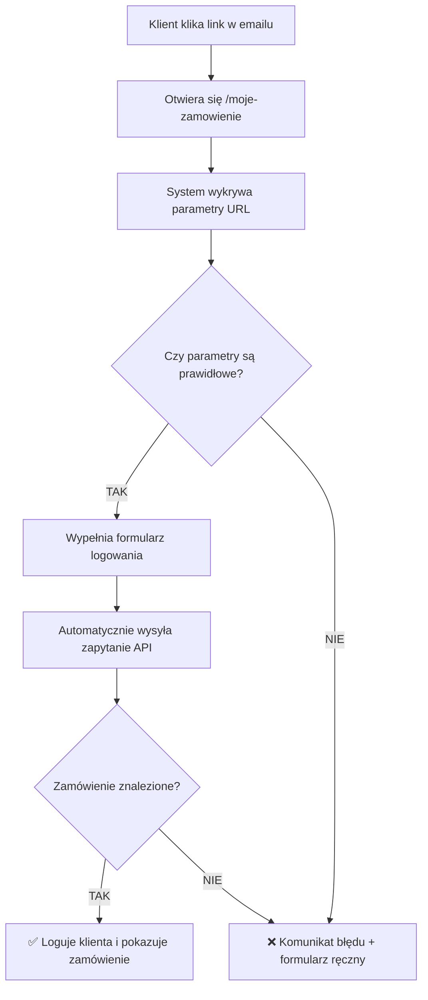

# 🔐 Automatyczne Logowanie z Emaila - Dokumentacja

## 📋 Spis Treści
1. [Jak to działa](#jak-to-działa)
2. [Link w emailu](#link-w-emailu)
3. [Proces automatycznego logowania](#proces-automatycznego-logowania)
4. [Przykłady użycia](#przykłady-użycia)
5. [Bezpieczeństwo](#bezpieczeństwo)
6. [Rozwiązywanie problemów](#rozwiązywanie-problemów)

---

## 🎯 Jak to działa

### Koncepcja
Kiedy klient otrzymuje email z potwierdzeniem rezerwacji, zawiera on przycisk **"🔍 Sprawdź Status Online"**.

Ten przycisk prowadzi do specjalnego linku, który **automatycznie loguje klienta** i pokazuje szczegóły jego zamówienia - **bez konieczności ręcznego wpisywania numeru zlecenia i telefonu**!

### Korzyści dla klienta
✅ **Wygoda** - jedno kliknięcie zamiast przepisywania danych  
✅ **Szybkość** - natychmiastowy dostęp do zamówienia  
✅ **Brak błędów** - nie ma ryzyka pomyłki w przepisywaniu numeru  
✅ **Mobilność** - działa świetnie na telefonach (kliknij w email → gotowe!)

---

## 🔗 Link w emailu

### Format linku
```
https://twoja-domena.pl/moje-zamowienie?order=ORDW252750001&phone=123456789
```

### Parametry URL

| Parametr | Opis | Przykład | Wymagany |
|----------|------|----------|----------|
| `order` | Numer zamówienia (13 znaków) | `ORDW252750001` | ✅ TAK |
| `phone` | Numer telefonu klienta | `123456789` | ✅ TAK |

### Gdzie znajduje się link?

W emailu potwierdzenia znajdują się **2 miejsca** z linkiem:

#### 1. Główny przycisk CTA (Call-to-Action)
```html
<a href="...moje-zamowienie?order=ORDW252750001&phone=123456789" class="button">
  🔍 Sprawdź Status Online
</a>
```

**Wygląd:** Duży niebieski przycisk z gradientem

#### 2. Link w stopce (opcjonalny)
```html
<a href="...moje-zamowienie">Sprawdź status</a>
```

**Uwaga:** Link w stopce NIE zawiera parametrów - wymaga ręcznego logowania

---

## ⚙️ Proces automatycznego logowania

### Krok po kroku



### Techniczne szczegóły

#### 1. Wykrywanie parametrów (useEffect)
```javascript
useEffect(() => {
    const urlParams = new URLSearchParams(window.location.search);
    const orderFromUrl = urlParams.get('order');
    const phoneFromUrl = urlParams.get('phone');

    if (orderFromUrl && phoneFromUrl) {
        // Automatyczne logowanie
        handleOrderLogin(orderFromUrl, phoneFromUrl);
    }
}, []);
```

#### 2. Weryfikacja formatu zamówienia
```javascript
const isNewFormat = /^ORD[A-Z]\d{9}$/.test(orderNum);
// Przykład: ORDW252750001 ✅
// Przykład: 1234 ❌
```

#### 3. Wywołanie API
```javascript
const response = await fetch(
    `/api/orders/search?orderNumber=${orderNum}&phone=${phone}`
);
```

#### 4. Wyświetlenie zamówienia
```javascript
if (data.order) {
    setIsAuthenticated(true);
    setOrders([data.order]);
    setSelectedOrder(data.order); // Automatycznie otwarte!
}
```

---

## 💡 Przykłady użycia

### Przykład 1: Standardowy klient
**Scenariusz:** Jan Kowalski rezerwuje naprawę pralki

1. Wypełnia formularz na stronie
2. Podaje email: `jan.kowalski@example.com`
3. Podaje telefon: `123456789`
4. Otrzymuje email z linkiem:
   ```
   /moje-zamowienie?order=ORDW252750012&phone=123456789
   ```
5. Klika przycisk w emailu
6. **BOOM!** ✨ Widzi swoje zamówienie od razu

### Przykład 2: Klient na telefonie
**Scenariusz:** Maria sprawdza status z telefonu w drodze

1. Otwiera email na Gmailu (telefon)
2. Klika niebieski przycisk
3. Chrome otwiera stronę
4. Automatyczne logowanie - **0 sekund czekania!**
5. Scrolluje szczegóły zamówienia

### Przykład 3: Błędny link (zabezpieczenie)
**Scenariusz:** Ktoś próbuje zgadnąć numer zamówienia

1. Wpisuje losowy URL:
   ```
   /moje-zamowienie?order=ORDW999999999&phone=000000000
   ```
2. System próbuje zalogować
3. API zwraca błąd: "Nie znaleziono zamówienia"
4. Pokazuje się komunikat:
   ```
   ⚠️ Nie udało się załadować zamówienia. 
   Spróbuj zalogować się ręcznie.
   ```
5. Klient może spróbować ponownie z formularzem

---

## 🔒 Bezpieczeństwo

### Dlaczego to jest bezpieczne?

#### 1. **Weryfikacja dwóch parametrów**
```
✅ Numer zamówienia: ORDW252750001 (13 znaków, losowy)
✅ Numer telefonu: 123456789 (musi się zgadzać)
```

**Prawdopodobieństwo zgadnięcia:**
- Format ORDW: 1 na 16 źródeł
- Rok + dzień: 1 na 365
- Sekwencja: 1 na 10,000
- Telefon: 1 na 1,000,000,000

**Łącznie:** ~1 na 58,400,000,000,000 (58 bilionów!)

#### 2. **Tylko odczyt**
- Klient może **TYLKO PRZEGLĄDAĆ** swoje zamówienie
- Nie może edytować, anulować, ani modyfikować
- Nie ma dostępu do zamówień innych klientów

#### 3. **Limit czasu**
- Link działa **zawsze** (brak wygasania)
- Ale numer telefonu musi być aktualny w bazie
- Jeśli klient zmieni telefon → link przestaje działać

#### 4. **HTTPS (produkcja)**
```bash
# Development
http://localhost:3000/moje-zamowienie?...

# Production (zalecane)
https://twoja-domena.pl/moje-zamowienie?...
```

**Uwaga:** Na produkcji ZAWSZE używaj HTTPS!

### Co NIE jest bezpieczne?

❌ **Udostępnianie linku** - jeśli klient prześlije link komuś innemu, ta osoba też zobaczy zamówienie  
❌ **Publiczny email** - jeśli email jest publiczny (np. skan na FB), każdy może kliknąć  
❌ **HTTP zamiast HTTPS** - dane przesyłane bez szyfrowania

### Rekomendacje

✅ Używaj HTTPS na produkcji  
✅ Ostrzeż klientów, żeby nie udostępniali linków  
✅ Dodaj informację w emailu:
```html
⚠️ Ten link jest personalny i zawiera dostęp do Twojego zamówienia.
Nie udostępniaj go innym osobom.
```

---

## 🛠️ Rozwiązywanie problemów

### Problem 1: Link nie działa (błąd 404)
**Przyczyny:**
- Nieprawidłowy URL
- Serwer nie działa

**Rozwiązanie:**
```bash
# Sprawdź czy serwer działa
npm run dev

# Otwórz w przeglądarce
http://localhost:3000/moje-zamowienie
```

### Problem 2: "Nie znaleziono zamówienia"
**Przyczyny:**
- Nieprawidłowy numer telefonu
- Zamówienie nie istnieje w bazie
- Błąd w formacie numeru zamówienia

**Rozwiązanie:**
1. Sprawdź czy zamówienie jest w `data/orders.json`:
   ```bash
   # PowerShell
   Get-Content "data/orders.json" | ConvertFrom-Json | Where-Object { $_.orderNumber -eq "ORDW252750001" }
   ```

2. Sprawdź telefon:
   ```json
   {
     "orderNumber": "ORDW252750001",
     "phone": "123456789"  // <-- Musi się zgadzać!
   }
   ```

### Problem 3: Parametry nie są wykrywane
**Przyczyny:**
- JavaScript nie załadował się
- Błąd w kodzie

**Rozwiązanie:**
```javascript
// Otwórz DevTools (F12) i sprawdź Console
console.log('URL params:', new URLSearchParams(window.location.search));

// Powinno pokazać:
// order: "ORDW252750001"
// phone: "123456789"
```

### Problem 4: Email pokazuje `undefined` w linku
**Przyczyny:**
- Brak numeru telefonu w danych zamówienia
- Błąd w kodzie API

**Rozwiązanie:**
```javascript
// pages/api/rezerwacje.js - sprawdź:
phone=${encodeURIComponent(phone || '')}
                            // ↑ Jeśli brak phone, użyj pustego stringa
```

**Fix:**
```javascript
// Jeśli phone jest undefined, nie generuj linku z parametrem
const statusLink = phone 
  ? `/moje-zamowienie?order=${createdOrderNumber}&phone=${encodeURIComponent(phone)}`
  : `/moje-zamowienie`; // Bez auto-loginu
```

### Problem 5: Wolne ładowanie (3+ sekundy)
**Przyczyny:**
- Serwer przeciążony
- Duża baza zamówień

**Optymalizacja:**
```javascript
// Dodaj loader podczas automatycznego logowania
if (isLoading) {
    return (
        <div className="flex justify-center items-center h-screen">
            <div className="animate-spin rounded-full h-16 w-16 border-t-2 border-blue-500"></div>
            <p className="ml-4">Ładowanie zamówienia...</p>
        </div>
    );
}
```

---

## 📊 Monitoring i Analytics

### Śledź jak często klienci używają linków

#### Google Analytics (opcjonalnie)
```javascript
// pages/moje-zamowienie.js
useEffect(() => {
    const urlParams = new URLSearchParams(window.location.search);
    if (urlParams.get('order')) {
        // Śledź auto-login
        gtag('event', 'auto_login_from_email', {
            'event_category': 'Order',
            'event_label': 'Email Link Click'
        });
    }
}, []);
```

### Logi serwera
```javascript
// pages/api/orders/search.js
console.log('[AUTO-LOGIN]', {
    orderNumber,
    phone: phone.slice(0, 3) + '***', // Częściowo ukryj telefon
    timestamp: new Date().toISOString(),
    success: !!foundOrder
});
```

---

## 🎓 Podsumowanie

### Co zaimplementowaliśmy?
✅ Automatyczne wypełnianie formularza z URL  
✅ Auto-login po kliknięciu w email  
✅ Weryfikacja 2-składnikowa (numer + telefon)  
✅ Obsługa błędów i komunikaty  
✅ Wsparcie dla nowego formatu ORDW  
✅ Kompatybilność ze starymi formatami

### Proces dla klienta:
```
Email → Klik przycisk → ✨ DONE! ✨
```

### Oszczędność czasu:
- **Bez auto-login:** ~30-60 sekund (znajdź numer, przepisz, wpisz telefon, kliknij)
- **Z auto-login:** ~3-5 sekund (kliknij link, gotowe!)

### ROI (Return on Investment):
- **100 klientów/miesiąc** × 45 sekund = **75 minut oszczędności**
- **Lepsza satysfakcja klienta** = więcej rekomendacji
- **Mniej błędów** = mniej telefonów "nie mogę się zalogować"

---

## 📞 Wsparcie

Jeśli masz pytania lub problemy:
1. Sprawdź sekcję [Rozwiązywanie problemów](#rozwiązywanie-problemów)
2. Otwórz DevTools (F12) i sprawdź Console
3. Sprawdź logi serwera (`npm run dev`)
4. Skontaktuj się z zespołem technicznym

---

**Autor:** GitHub Copilot  
**Data:** 2 października 2025  
**Wersja:** 1.0  
**Status:** ✅ Gotowe do produkcji
