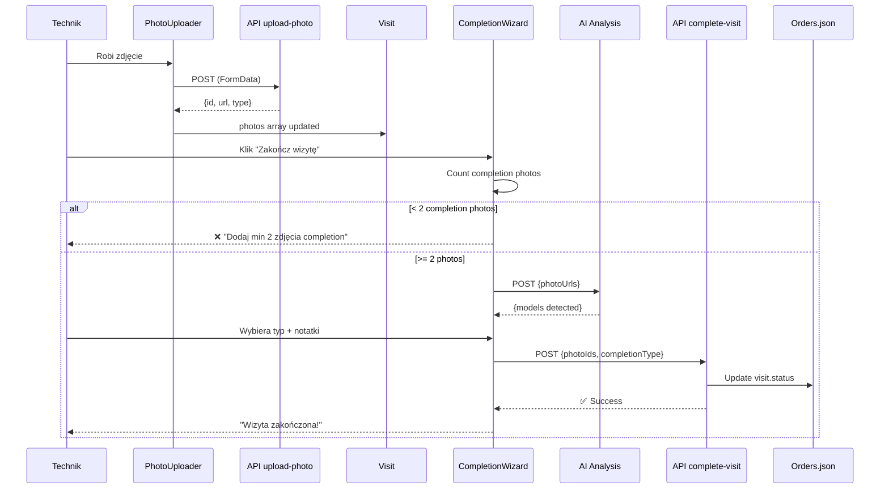

# ✅ INTEGRACJA ZAKOŃCZONA
## CompletionWizard + PhotoUploader

**Data:** 2025-10-13  
**Status:** ✅ Gotowe do testowania

---

## 🎯 Co zrobiono:

### 1. **Integracja z istniejącym PhotoUploader** ✅
- CompletionWizard używa istniejącego komponentu `PhotoUploader.js`
- Zdjęcia uploadowane normalnie przez PhotoUploader (z kategoriami)
- System liczy tylko **completion photos**: `after`, `completion`, `serial`

### 2. **Zmiana archite ktury upload** ✅
- **STARE**: CompletionWizard uploadował zdjęcia przy submission (FormData)
- **NOWE**: Zdjęcia już uploadowane, CompletionWizard referencuje po ID
- Mniej duplikacji, szybszy workflow

### 3. **Walidacja min 2 zdjęć completion** ✅
```javascript
const completionPhotos = photos.filter(p => 
  p.type === 'after' || p.type === 'completion' || p.type === 'serial'
);

// Walidacja
if (completionPhotos.length < 2) {
  // Nie można przejść dalej
}
```

### 4. **Backend API zaktualizowany** ✅
- `/api/technician/complete-visit` przyjmuje JSON (nie FormData)
- Waliduje `completionPhotoIds.length >= 2`
- Zdjęcia już w `visit.photos`, tylko referencja

### 5. **AI Analysis zaktualizowany** ✅
- `/api/ai/analyze-visit-photos` przyjmuje `photoUrls` (ścieżki)
- OCR działa na istniejących plikach w `public/uploads`
- Nie trzeba uploadować ponownie

---

## 📸 Workflow użytkownika:

### Krok 1: Dodaj zdjęcia podczas wizyty
```
Technik w trakcie wizyty:
1. Otwiera kartę "Zdjęcia"
2. Robi zdjęcia (lub wybiera z galerii)
3. Wybiera kategorię:
   - 📷 Przed pracą
   - 🔧 W trakcie
   - ✅ Po pracy          ← COMPLETION
   - ⚠️ Problem
   - 🎉 Ukończenie        ← COMPLETION
   - 🔢 Tabliczka         ← COMPLETION
4. Upload natychmiast (PhotoUploader)
```

### Krok 2: Zakończ wizytę
```
Technik kończy wizytę:
1. Klika "Zakończ wizytę"
2. CompletionWizard sprawdza:
   - Min 2 zdjęcia "completion" (after/completion/serial) ✅
3. 🤖 AI automatycznie analizuje tabliczki
4. Wybiera typ zakończenia (5 opcji)
5. Dodaje notatki
6. Zatwierdza
7. ✅ Wizyta completed
```

---

## 🔧 Co się dzieje pod maską:



---

## 📦 Pliki zmienione:

### Frontend
- ✅ `components/technician/CompletionWizard.js`
  - Import PhotoUploader
  - Używa onPhotosUpdate callback
  - Liczy completionPhotos
  - Walidacja min 2 zdjęć

### Backend
- ✅ `pages/api/technician/complete-visit.js`
  - Zmieniono z FormData na JSON
  - Walidacja completionPhotoIds
  - Referencja photoIds zamiast upload

- ✅ `pages/api/ai/analyze-visit-photos.js`
  - Zmieniono z FormData na JSON
  - Przyjmuje photoUrls (ścieżki)
  - OCR na istniejących plikach

### Dokumentacja
- ✅ `COMPLETION_QUICK_START.md`
  - Zaktualizowano instrukcje (nie trzeba formidable)
  - Folder już istnieje

---

## ⚙️ Następne kroki:

### 1. Instalacja Tesseract.js
```bash
npm install tesseract.js
```

### 2. Integruj w visit details page
Otwórz `pages/technician/visit/[visitId].js`:

```javascript
import CompletionWizard from '../../components/technician/CompletionWizard';

const [showCompletionWizard, setShowCompletionWizard] = useState(false);

// Przycisk
<button 
  onClick={() => setShowCompletionWizard(true)}
  disabled={visit.status !== 'in_progress'}
>
  ✅ Zakończ wizytę
</button>

// Modal
{showCompletionWizard && (
  <CompletionWizard
    visit={visit}
    onComplete={async (result) => {
      console.log('✅ Completed:', result);
      setShowCompletionWizard(false);
      await loadVisit(); // Reload
    }}
    onCancel={() => setShowCompletionWizard(false)}
  />
)}
```

### 3. Test workflow
```
1. Zaloguj jako technik
2. Otwórz wizytę (status: in_progress)
3. Dodaj 2+ zdjęcia kategorii "Po pracy" lub "Ukończenie"
4. Kliknij "Zakończ wizytę"
5. Wybierz typ (np. Naprawa zakończona)
6. Zatwierdź
7. ✅ Sprawdź data/orders.json
```

---

## 💡 Zalety nowej architektury:

✅ **Mniej duplikacji** - zdjęcia uploadowane raz  
✅ **Szybszy workflow** - PhotoUploader podczas wizyty, completion później  
✅ **Offline ready** - PhotoUploader ma offline support  
✅ **Lepsze UX** - widać zdjęcia natychmiast po dodaniu  
✅ **AI w tle** - nie blokuje dodawania zdjęć  
✅ **Walidacja** - wymusza min 2 zdjęcia completion  

---

## 🐛 Known Issues:

⚠️ **AI Analysis wymaga pełnej ścieżki** - photoUrls muszą być absolutne lub relatywne do `public/`

⚠️ **Offline sync** - Service Worker trzeba zarejestrować w `_app.js`

⚠️ **Notification permission** - Użytkownik musi zaakceptować notyfikacje

---

## 📞 Potrzebna pomoc?

Sprawdź:
- `SMART_VISIT_COMPLETION_DOCS.md` - pełna dokumentacja
- `COMPLETION_QUICK_START.md` - quick setup guide
- Console logs - `🤖 AI`, `📸`, `✅` prefixes

---

**Status:** ✅ Gotowe do wdrożenia!  
**Następny krok:** `npm install tesseract.js` → integracja w visit page → test
